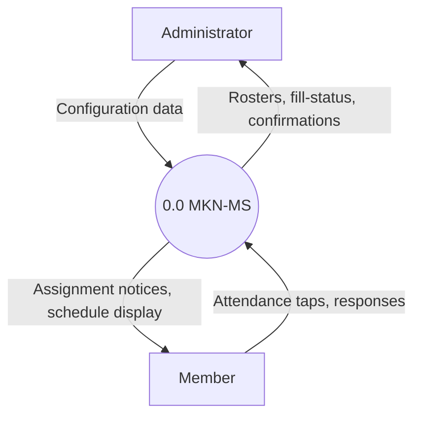
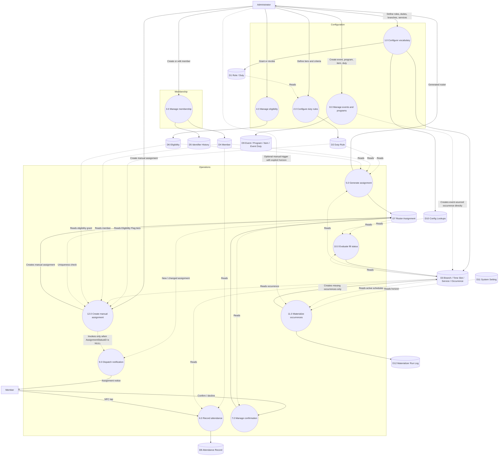
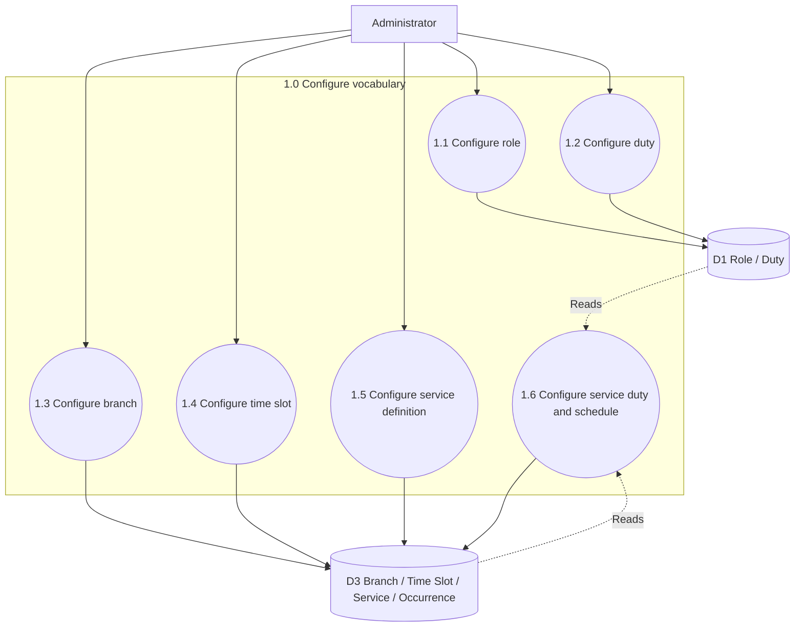
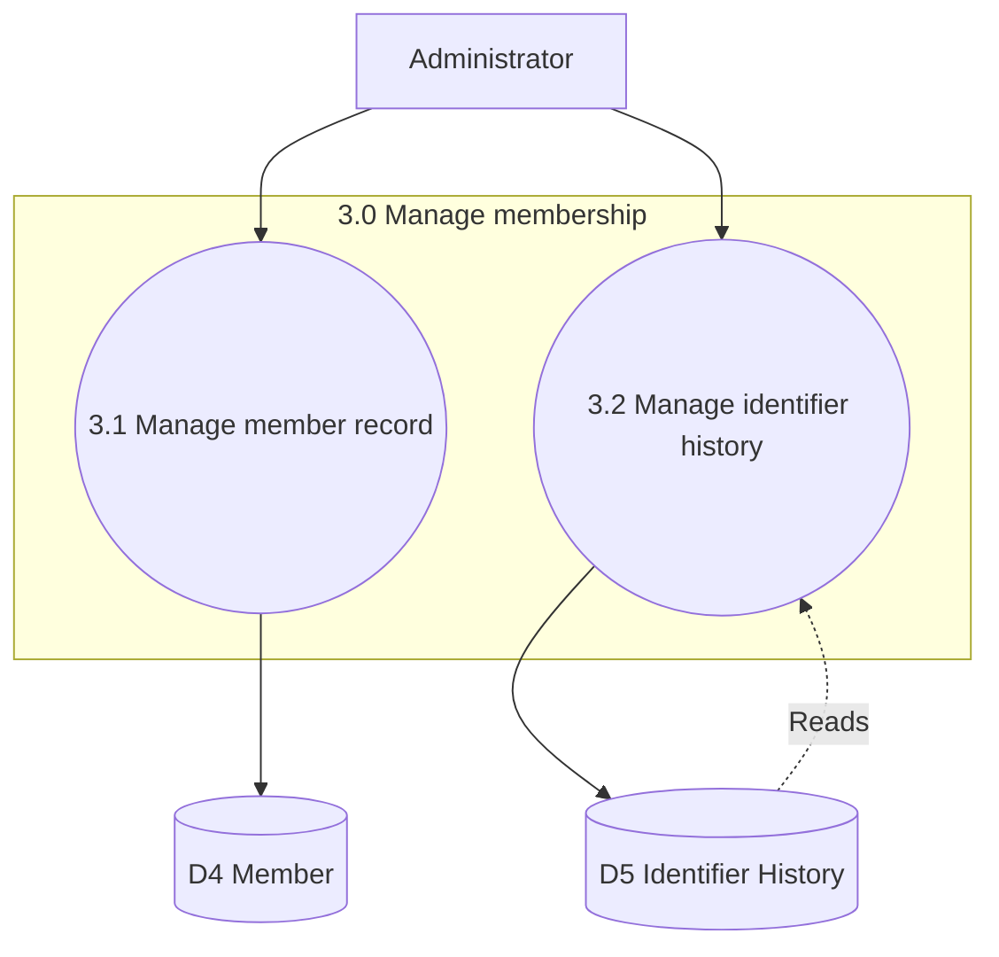
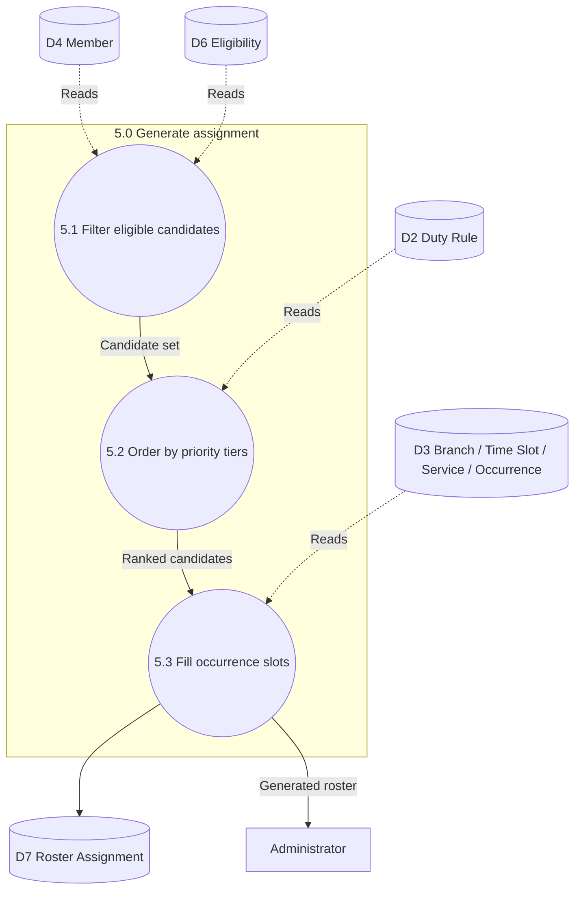
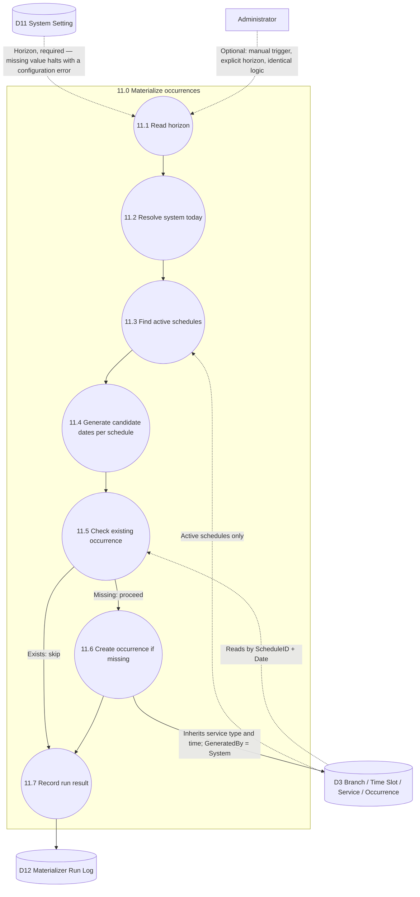

# MKN-MS — Data Flow Diagrams

*Scoped strictly to the current System Design Specification. No security, sessions, authorization, data-retention, or support/incident infrastructure.*

Standard DFD notation: rectangles are external entities, circles are processes (numbered), cylinders are data stores (D#).

---

## Level 0 — Context Diagram

---

Level 1 — Process Decomposition

Twelve processes. 11.0 Materialize Occurrences is system/time-triggered, with an optional manual trigger from Administrator. 12.0 Create Manual Assignment is administrator-triggered, with no scheduled component. These are the only two processes without a required external-entity input on their primary trigger path.

---

Level 2 — Configure Vocabulary (1.0)

---

Level 2 — Manage Membership (3.0)

---

Level 2 — Generate Assignment (5.0)

Mirrors the Eligibility → Priority → Assignment component chain directly.

---

Level 2 — Materialize Occurrences (11.0)

The fully specified contract from the System Design Specification §7, as a flow.

Every existing occurrence this process encounters is left untouched — the only output to D3 is the creation of rows that did not previously exist.

---

Process Dictionary

# Process Reads from Writes to
1.0 Configure vocabulary — D1, D3, D10
2.0 Configure duty rules D1 D2
3.0 Manage membership — D4, D5
4.0 Manage eligibility — D6
5.0 Generate assignment D2, D3, D4, D6, D7 D7
6.0 Record attendance D4, D3 D8
7.0 Manage confirmation D7, D10, D11 D7
8.0 Manage events and programs — D9, D3 (event-sourced occurrences)
9.0 Dispatch notification D7, D4, D3, D11 — (outbound to Member)
10.0 Evaluate fill status D7, D3, D10, D11 D3

11.0 Materialize occurrences D11, D3 D3, D12
12.0 Create manual assignment D2, D3, D4, D6, D7 D7

Data Store Dictionary

Store Contents
D1 Role, Duty
D2 Duty Rule
D3 Branch, Branch Time Slot, Service Definition, Service Definition Duty, Service Schedule, Service Occurrence, Service Occurrence Duty
D4 Member
D5 Identifier History
D6 Eligibility
D7 Roster Assignment
D8 Attendance Record
D9 Event, Program, Program Item, Event Duty
D10 Outcome State, Assignment Status, Permission Tier, TimeOfDay, ServiceType
D11 System Setting
D12 Materializer Run Log

---

Resolved design decisions

· Occurrence materialization is a system-internal, daily-triggered, idempotent process on a rolling horizon, fully specified in §7 of the System Design Specification and shown as process 11.0 above.
· Duty Rule tier composition supports multiple criteria per tier via same-TierOrder rows, combined with AND; no OR or NOT at this stage.

What was deliberately excluded

Authentication, session management, authorization/RBAC, privilege escalation protection, data classification and retention policy, and a full support/incident/problem/change/maintenance practice. None of that is represented here.
